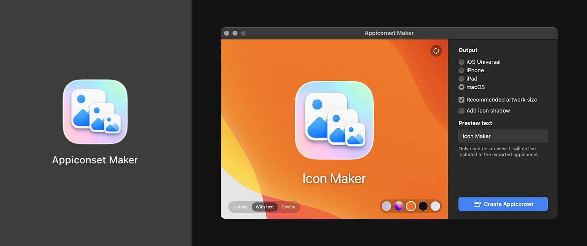

# Appiconset Maker

macOS app for generating Xcode `AppIcon.appiconset` folders from a single 1024 x 1024 source image. Drop in an image, choose the target platform, preview the result, and export a ready-to-use app icon asset catalog folder.



## Features

- Drag and drop an image or choose one with the file picker
- Validates that the source image is square and at least 1024 x 1024 px
- Generates `AppIcon.appiconset` with PNG renditions and `Contents.json`
- Supports iOS Universal, iPhone, iPad, and macOS icon sets
- Automatically resizes larger source images down to 1024 x 1024 px
- Provides live preview modes for the default icon, device mockups, and icon with text
- Supports custom preview text without baking it into the exported assets
- macOS option for recommended 832 x 832 artwork centered on a 1024 x 1024 canvas
- Optional macOS icon shadow for preview and exported assets
- Reveals the generated appiconset in Finder after export

## Requirements

- macOS 15.5+
- Xcode 16+
- Swift 5

The project has no third-party package dependencies. Clone it and open it in Xcode.

## Run

Using Xcode:

1. Open `Appiconset Maker/Appiconset Maker.xcodeproj`
2. Select the `Appiconset Maker` scheme
3. Run the app

Using the command line:

```bash
xcodebuild \
  -project "Appiconset Maker/Appiconset Maker.xcodeproj" \
  -scheme "Appiconset Maker" \
  -destination "platform=macOS" \
  build
```

## Test

```bash
xcodebuild \
  test \
  -project "Appiconset Maker/Appiconset Maker.xcodeproj" \
  -scheme "Appiconset Maker" \
  -destination "platform=macOS" \
  -derivedDataPath ".deriveddata/test"
```

## Local Install

The repo includes an install script that will:

- Build the app with the `Release` configuration
- Stop the currently running `Appiconset Maker` process if needed
- Copy the `.app` bundle to `/Applications`

Command:

```bash
./scripts/install_local.sh
```

## Project Structure

```text
.
├── README.md
├── screenshot.png
├── Appiconset Maker/
│   ├── Appiconset Maker.xcodeproj
│   ├── Appiconset Maker/
│   │   ├── Appiconset_MakerApp.swift
│   │   ├── ContentView.swift
│   │   ├── Services/
│   │   │   └── AppIconGenerator.swift
│   │   ├── Views/
│   │   ├── Components/
│   │   ├── Models/
│   │   ├── Utilities/
│   │   ├── Mockups/
│   │   ├── Appiconset_Maker.entitlements
│   │   └── Assets.xcassets/
│   ├── Appiconset MakerTests/
│   └── Appiconset MakerUITests/
├── Appiconset Maker-icon/
└── scripts/
```

## License

MIT License
